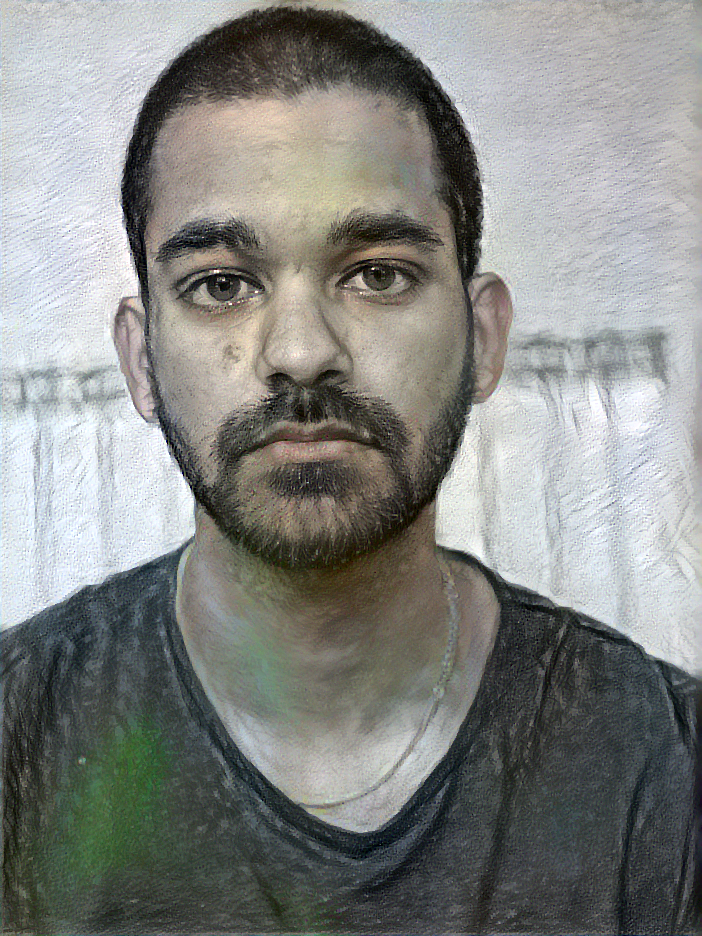
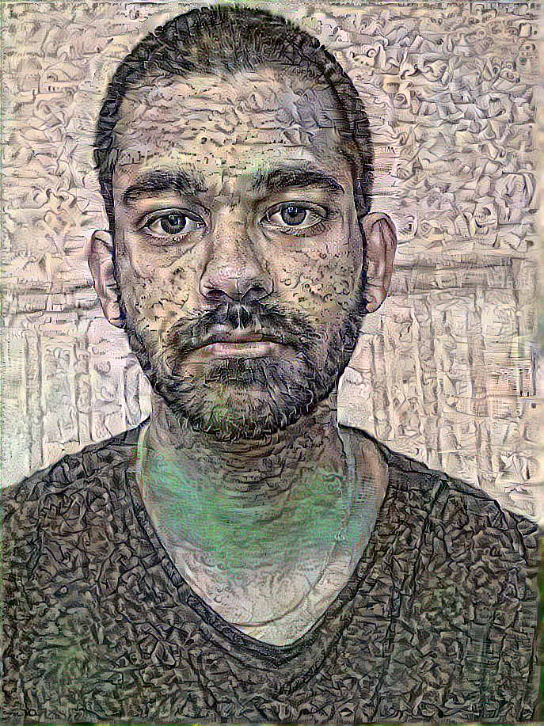
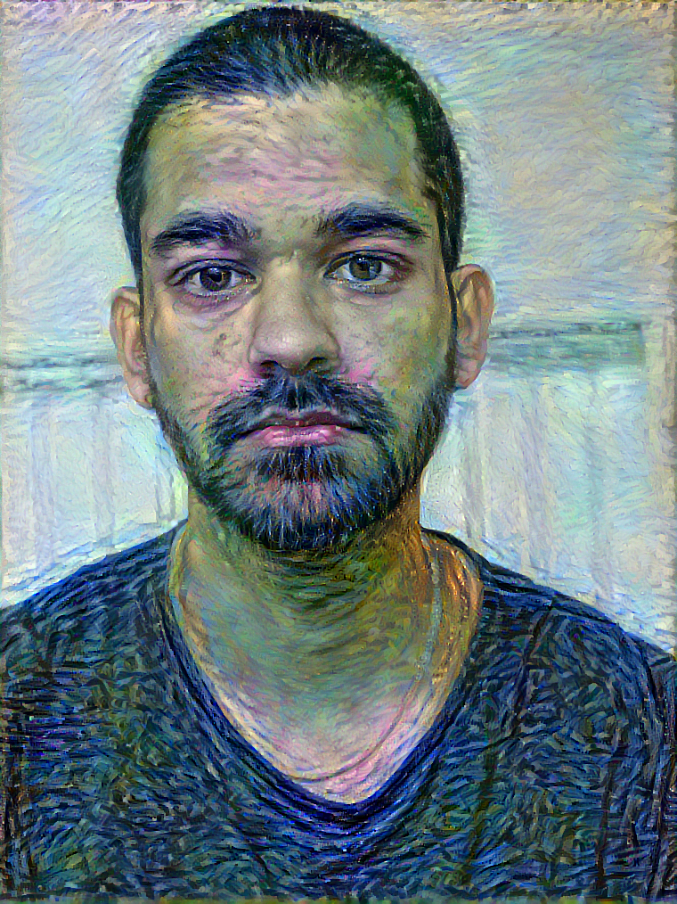
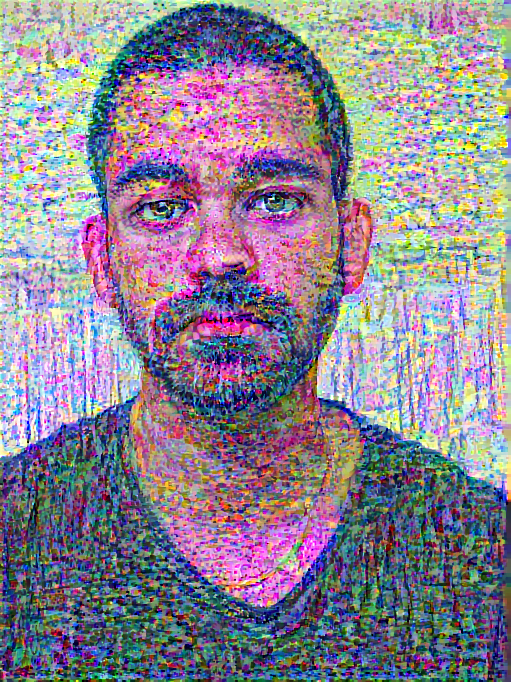

# Neural Style Transfer

In tasks such as objection recognition and detection, neural networks have long been a success often surpassing even human capabilities. However the realms of the creative industries and art are a little more tricky. In their [paper](https://arxiv.org/abs/1508.06576) Gatys et al. demonstrated a technique called neural style transfer to alter a content image to mimic the style of a given style image. The premise of the paper showed it is possible to seperate the style and content representations of a CNN.  

Here NST.py is a neural style transfer script that takes two images as input. It will merge the two images extracting the 'content' from the content image from higher level convolutional layers in a pretrained VGG-19 model. The 'style' information from the style image is obtained from the correlation between the feature maps of the lower layers. This is achieved by computing a Gram matrix.  

To demonstrate I've included some examples. To start with we need a 'content' image to stylise, so I grabbed a photo of this handsome fella :heart_eyes:  

And after some style transfers using different famous drawings and paintings.

   
  
   
  

### References

Some useful links:

1. [The paper](https://arxiv.org/abs/1508.06576)
2. [A tensorflow implementation](https://www.tensorflow.org/tutorials/generative/style_transfer)
